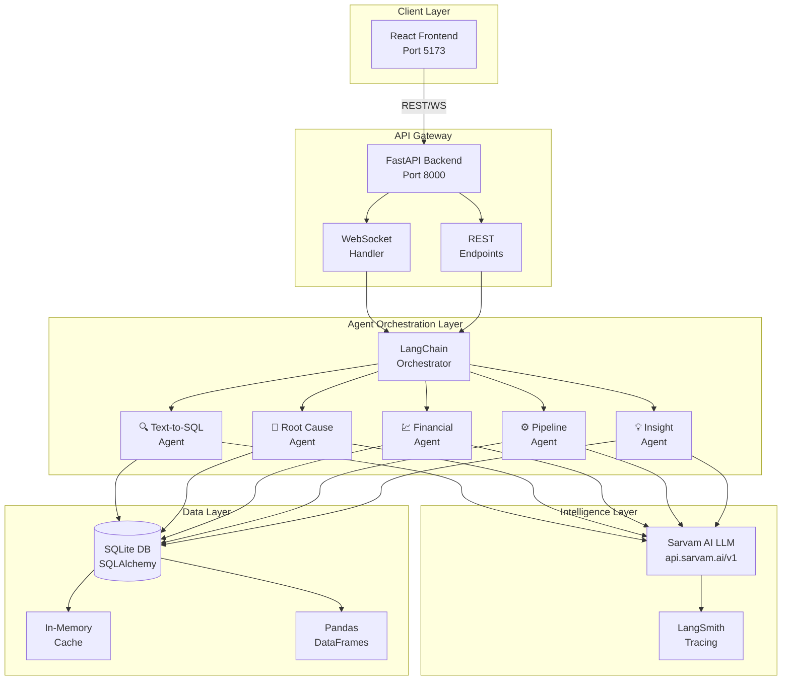
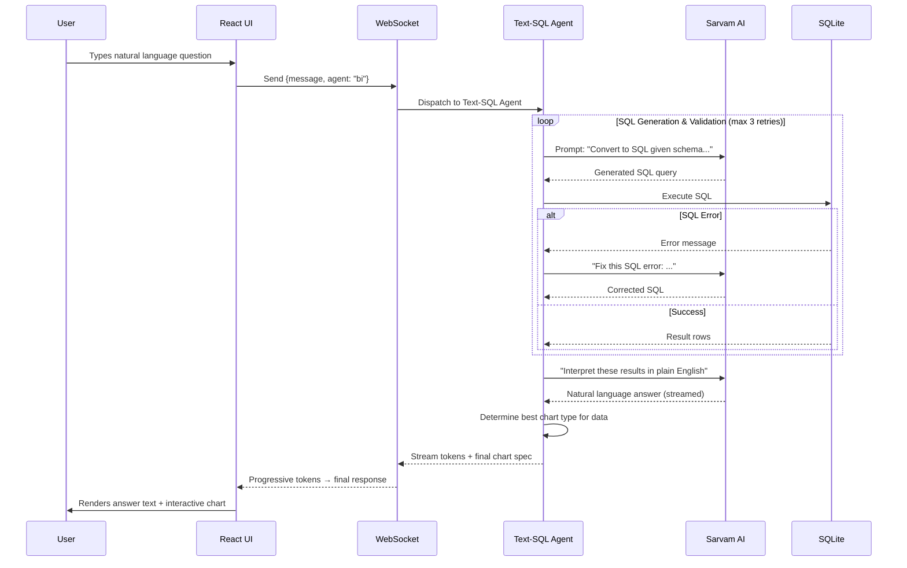
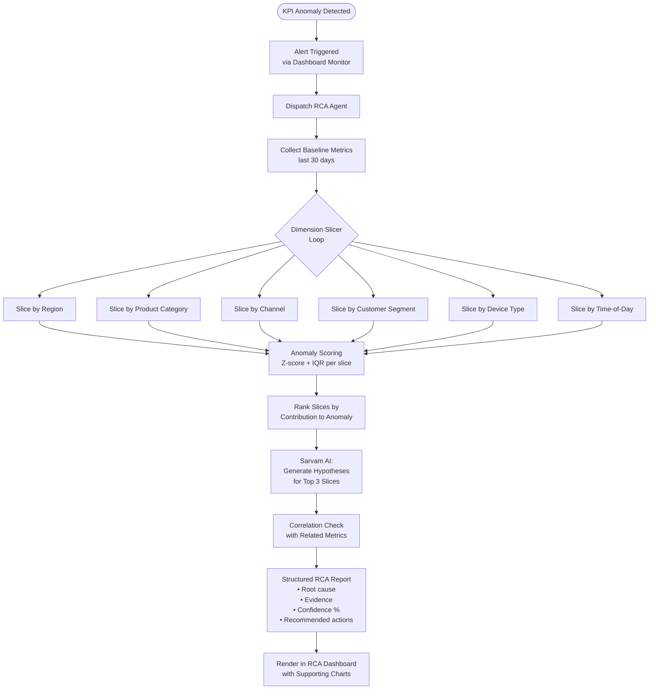
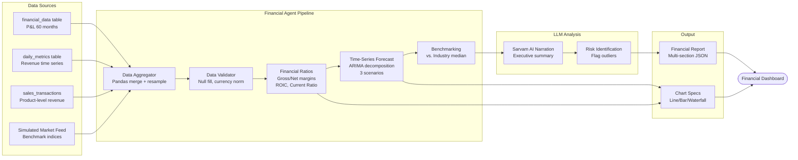
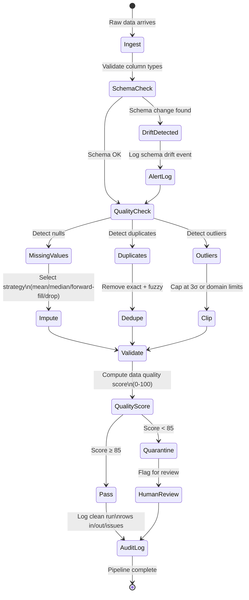
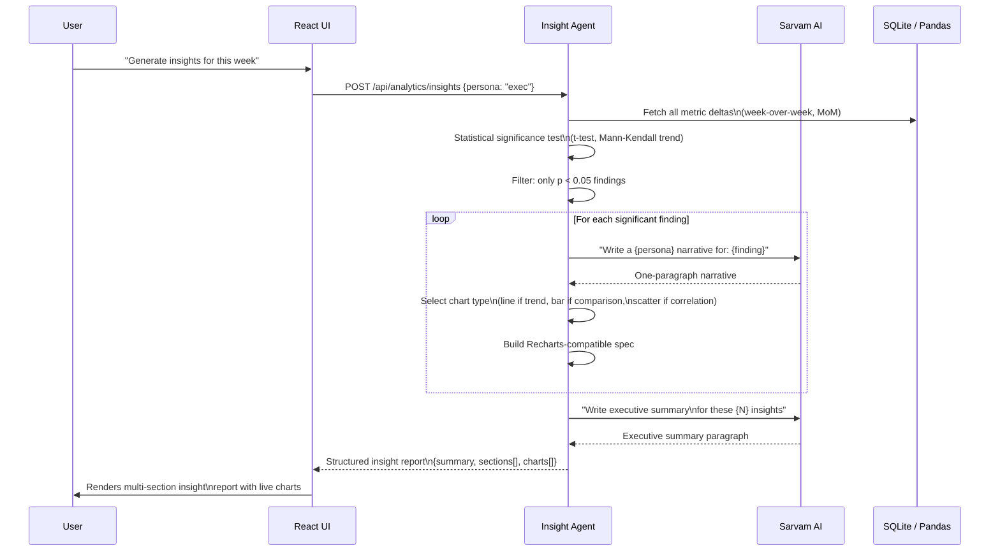
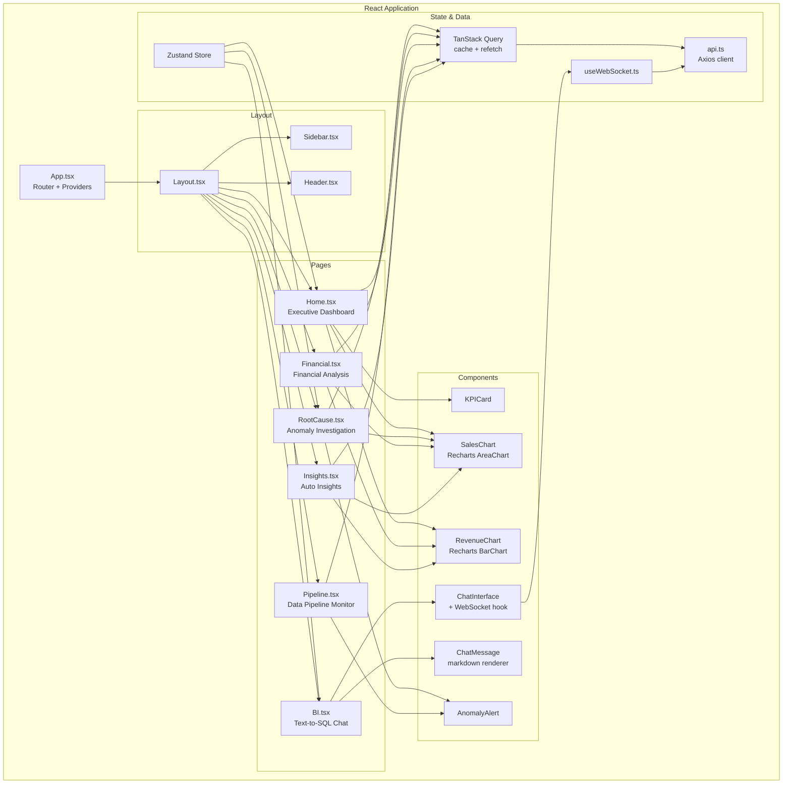
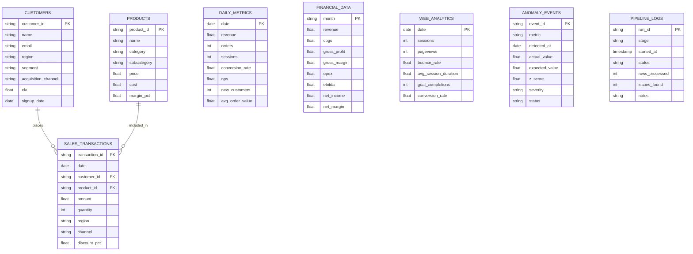
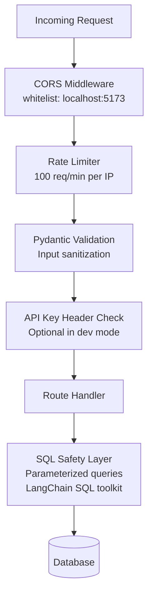
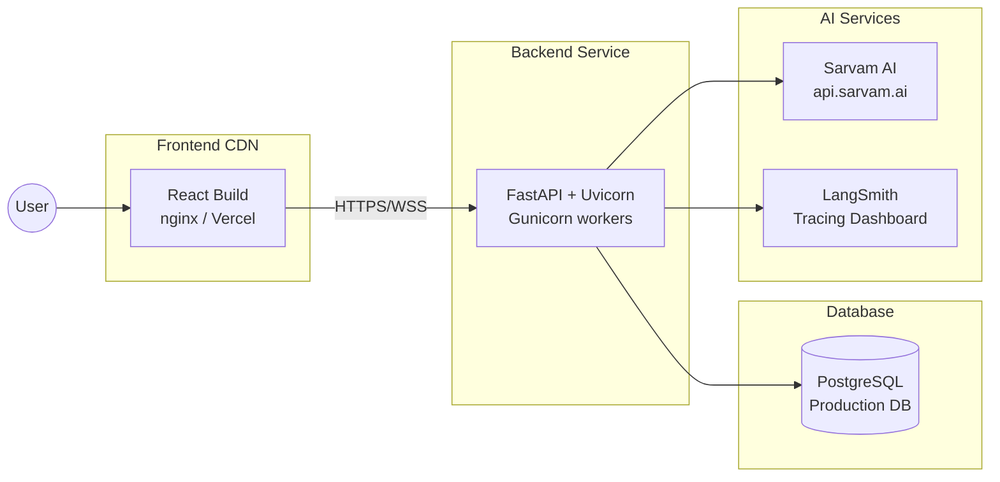

# Agitator Rye — System Architecture & Workflows

## 1. High-Level System Architecture

---

## 2. Workflow 1: Conversational Business Intelligence (Text-to-SQL)

---

## 3. Workflow 2: Automated Root Cause Analysis

---

## 4. Workflow 3: Advanced Financial & Investment Analysis

---

## 5. Workflow 4: Dynamic Data Cleaning & Pipeline Management

---

## 6. Workflow 5: Automated Insight Generation & Charting

---

## 7. Component Architecture (Frontend)

---

## 8. Database Entity Relationship

---

## 9. Security Architecture

---

## 10. Deployment Architecture (Production)

---

*Agitator Rye Architecture v1.0 — Generated May 2026*
