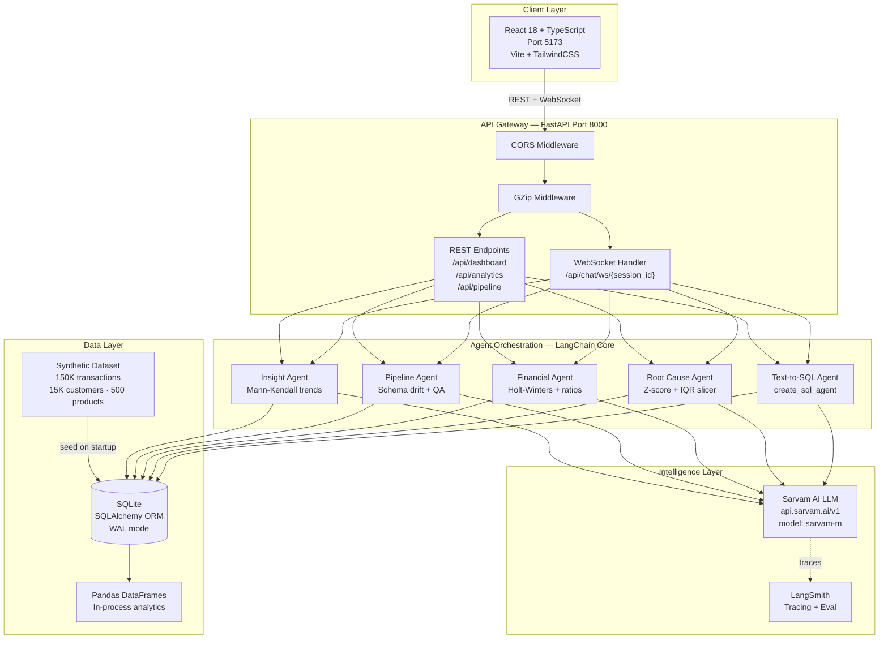
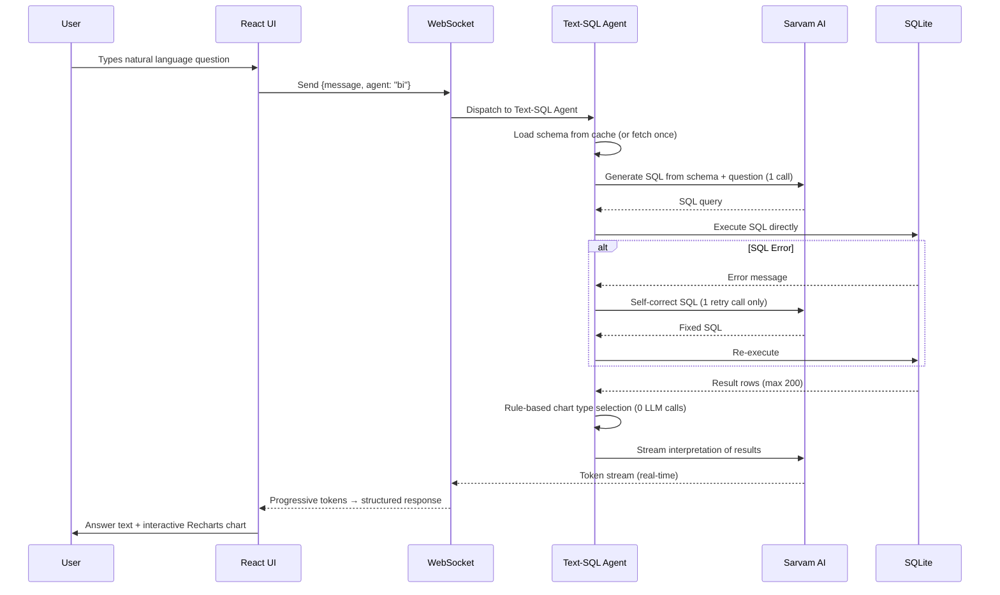
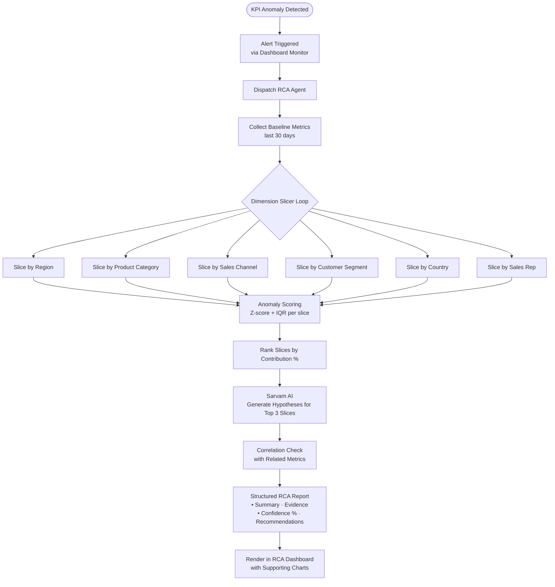
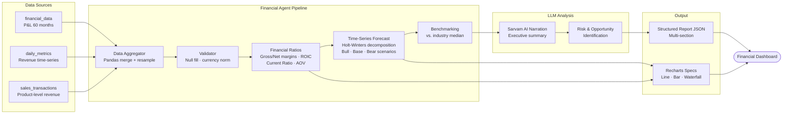
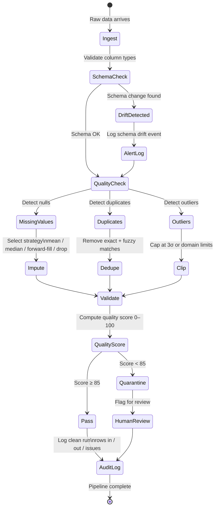
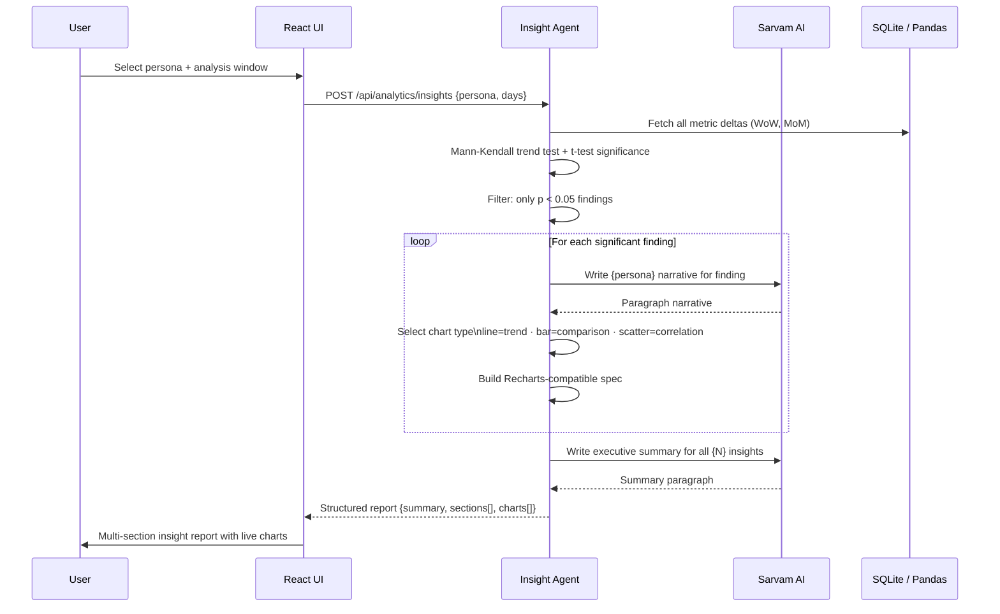
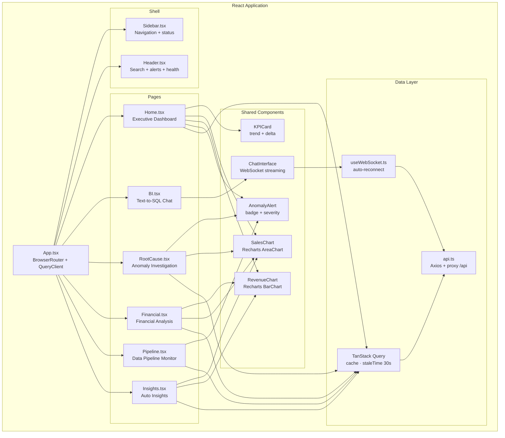
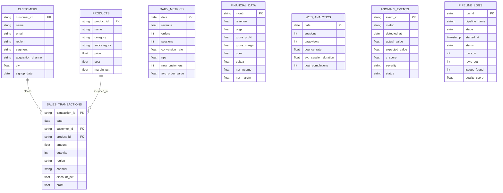
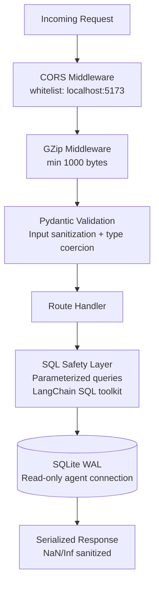
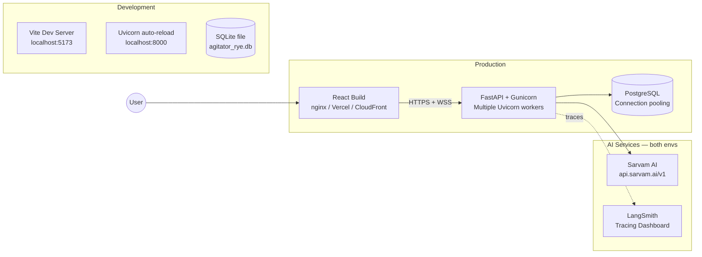

# Agitator Rye — Enterprise Analytics Intelligence Platform

> An AI-native analytics agent platform powered by LangChain and Sarvam AI, delivering conversational BI, automated root cause analysis, financial intelligence, and dynamic insight generation through an enterprise-grade React dashboard.

---

## Table of Contents

- [Overview](#overview)
- [Core Use Cases](#core-use-cases)
- [System Architecture](#system-architecture)
- [Workflow 1 — Conversational BI (Text-to-SQL)](#workflow-1--conversational-bi-text-to-sql)
- [Workflow 2 — Root Cause Analysis](#workflow-2--root-cause-analysis)
- [Workflow 3 — Financial Analysis](#workflow-3--financial-analysis)
- [Workflow 4 — Data Pipeline Management](#workflow-4--data-pipeline-management)
- [Workflow 5 — Auto Insight Generation](#workflow-5--auto-insight-generation)
- [Frontend Component Architecture](#frontend-component-architecture)
- [Database Entity Relationship](#database-entity-relationship)
- [Security Architecture](#security-architecture)
- [Deployment Architecture](#deployment-architecture)
- [Technology Stack](#technology-stack)
- [Project Structure](#project-structure)
- [Installation & Setup](#installation--setup)
- [Running the Application](#running-the-application)
- [API Reference](#api-reference)
- [Data Schema](#data-schema)
- [Environment Variables](#environment-variables)
- [Agent Capabilities](#agent-capabilities)

---

## Overview

**Agitator Rye** is an enterprise-grade, multi-agent analytics platform that transforms raw business data into real-time intelligence. It combines five specialized AI agents — each orchestrated by LangChain and powered by Sarvam AI — with a sleek React dashboard, giving analysts, executives, and engineers a single source of truth for all business intelligence.

The platform ships with a synthetic dataset of **150,000+ sales transactions**, **15,000 customer profiles**, **500 products**, **5 years of financial time-series**, and **web analytics data**, making every agent immediately functional out of the box.

---

## Core Use Cases

### 1. Conversational Business Intelligence (Text-to-SQL)
Ask questions in plain English. The BI Agent:
- Translates natural language → SQL using LangChain's SQL Agent
- Executes queries safely against the SQLite database
- Self-corrects on SQL errors (up to 3 retries)
- Returns answers as prose, tables, or auto-generated charts

**Example queries:**
- *"What were the top 5 products by revenue last quarter?"*
- *"Show me the month-over-month growth in the North region"*
- *"Which customers have the highest lifetime value?"*

### 2. Automated Root Cause Analysis
When a KPI anomaly is detected, the RCA Agent:
- Slices metrics across 8+ dimensions (region, product, channel, cohort…)
- Applies statistical anomaly detection (z-score + IQR)
- Identifies the primary contributing factors
- Generates a structured root cause report with confidence scores

### 3. Advanced Financial & Investment Analysis
The Financial Agent compiles deep-dive reports by:
- Aggregating P&L, cash flow, and balance sheet data
- Running time-series forecasting (ARIMA/Prophet-style)
- Benchmarking against industry simulations
- Producing portfolio-style visualizations

### 4. Dynamic Data Cleaning & Pipeline Management
A multi-agent pipeline that:
- Detects missing values, duplicates, schema drift, outliers
- Applies configurable cleaning strategies per column
- Logs every transformation with full audit trail
- Produces data quality scorecards

### 5. Automated Insight Generation & Charting
Instead of static reports, the Insight Agent:
- Scans all metrics for statistically significant patterns
- Generates narrative summaries tailored to the user's role (exec / analyst / engineer)
- Auto-builds Recharts-compatible visualization specs
- Assembles multi-section insight reports on demand

---

## System Architecture



---

## Workflow 1 — Conversational BI (Text-to-SQL)



---

## Workflow 2 — Root Cause Analysis



---

## Workflow 3 — Financial Analysis



---

## Workflow 4 — Data Pipeline Management



---

## Workflow 5 — Auto Insight Generation



---

## Frontend Component Architecture



---

## Database Entity Relationship



---

## Security Architecture



---

## Deployment Architecture



---

## Technology Stack

| Layer | Technology | Version |
|---|---|---|
| **Frontend** | React + TypeScript, Vite, TailwindCSS | 18.3, 5.4, 3.4 |
| **Charts** | Recharts, Framer Motion | 2.13, 11 |
| **State / Data** | TanStack Query, Zustand | 5, 4 |
| **Backend** | FastAPI, Uvicorn | 0.13+, 0.48+ |
| **AI Orchestration** | LangChain Core, LangChain Community | 1.x |
| **LLM** | Sarvam AI (OpenAI-compatible endpoint) | sarvam-m |
| **Tracing** | LangSmith | latest |
| **Database** | SQLite (WAL) via SQLAlchemy ORM | 2.0+ |
| **Data Science** | Pandas, NumPy, SciPy, Scikit-learn, Statsmodels | latest |
| **Runtime** | Python 3.11+, Node.js 18+ | — |

---

## Project Structure

```
agitator-rye/
├── README.md
├── ARCHITECTURE.md
├── requirements.txt
├── .env.example
├── .env                          # Your actual keys (gitignored)
│
├── backend/
│   ├── run.py                    # Entry point
│   └── app/
│       ├── main.py               # FastAPI app, middleware, routers
│       ├── core/
│       │   ├── config.py         # Pydantic settings
│       │   ├── database.py       # SQLAlchemy engine + tables
│       │   └── llm.py            # Sarvam AI LLM client
│       ├── agents/
│       │   ├── text_to_sql_agent.py
│       │   ├── root_cause_agent.py
│       │   ├── financial_agent.py
│       │   ├── pipeline_agent.py
│       │   └── insight_agent.py
│       ├── api/routes/
│       │   ├── chat.py           # WebSocket + REST chat
│       │   ├── analytics.py      # Query endpoints
│       │   ├── dashboard.py      # Dashboard data
│       │   └── pipeline.py       # Pipeline management
│       ├── data/
│       │   └── synthetic_data.py # Generates 150k+ row dataset
│       └── models/
│           └── schemas.py        # Pydantic request/response models
│
└── frontend/
    ├── index.html
    ├── package.json
    ├── vite.config.ts
    ├── tailwind.config.js
    └── src/
        ├── App.tsx
        ├── index.css
        ├── main.tsx
        ├── services/api.ts
        ├── hooks/useWebSocket.ts
        ├── components/
        │   ├── Layout/           # Sidebar, Header, Layout
        │   ├── Dashboard/        # KPICard, SalesChart, etc.
        │   └── Chat/             # ChatInterface, ChatMessage
        └── pages/
            ├── Home.tsx          # Executive dashboard
            ├── BI.tsx            # Text-to-SQL chat
            ├── RootCause.tsx     # Anomaly investigation
            ├── Financial.tsx     # Financial analysis
            ├── Pipeline.tsx      # Data pipeline monitor
            └── Insights.tsx      # Auto-generated insights
```

---

## Installation & Setup

### Prerequisites
- Python 3.11+ (Anaconda / conda recommended on Windows)
- Node.js 18+
- npm

### 1. Clone and enter the project

```bash
cd "agitator rye"
```

### 2. Backend — Conda (recommended on Windows)

```bash
# Create a fresh conda env
conda create -n agents python=3.11 -y
conda activate agents

# Install all dependencies
pip install -r requirements.txt
```

### 2b. Backend — Standard venv (Linux / macOS)

```bash
cd backend
python -m venv venv
source venv/bin/activate
pip install -r ../requirements.txt
```

### 3. Configure Environment Variables

```bash
copy .env.example .env   # Windows
cp .env.example .env     # macOS/Linux
```

Edit `.env`:
```env
SARVAM_API_KEY=sk_your_key_here
LANGSMITH_API_KEY=lsv2_pt_your_key_here
```

### 4. Frontend Setup

```bash
cd frontend
npm install
```

---

## Running the Application

### Option A — One-command launch (PowerShell)

```powershell
.\start.ps1
```

This starts both servers in separate windows using the `agents` conda environment.

### Option B — Manual start

**Backend:**
```bash
cd backend
# conda env
conda run -n agents python run.py
# or direct path
C:\...\Anaconda3\envs\agents\python.exe run.py

# API: http://localhost:8000
# Swagger UI: http://localhost:8000/docs
```

**Frontend:**
```bash
cd frontend
npm run dev
# Dashboard: http://localhost:5173
```

> The database is seeded automatically on first backend startup (~30s for 150K rows).

---

## API Reference

### Health
```
GET  /health                            → Platform status + record counts
GET  /docs                              → Swagger interactive API explorer
```

### WebSocket — Streaming Chat
```
WS   /api/chat/ws/{session_id}
```
Send:
```json
{ "message": "Top 5 products last quarter?", "agent": "bi" }
```
Agents: `bi` · `rca` · `financial` · `pipeline` · `insight`

Receive: streamed token chunks, then a final structured response.

### Dashboard
```
GET  /api/dashboard/kpis                → 6 KPI cards with delta vs prior period
GET  /api/dashboard/sales-trend?days=90 → Revenue/orders time-series
GET  /api/dashboard/revenue-breakdown   → Revenue by region, channel, category
GET  /api/dashboard/anomalies           → Active anomaly alerts
GET  /api/dashboard/pipeline-health     → Quality scores per pipeline stage
GET  /api/dashboard/web-analytics       → Sessions, bounce rate, conversion
```

### Analytics
```
POST /api/analytics/query               → Natural language → SQL → result + chart
POST /api/analytics/rca                 → Root cause analysis on a metric
POST /api/analytics/financial           → Financial report with forecast
POST /api/analytics/insights            → Auto-generate insight report
GET  /api/analytics/metrics             → Raw metric time-series
```

### Pipeline
```
POST /api/pipeline/run                  → Trigger data quality pipeline
GET  /api/pipeline/logs?limit=50        → Audit log of all pipeline runs
GET  /api/pipeline/tables               → List available tables + row counts
```

---

## Data Schema

| Table | Rows | Key Columns |
|-------|------|-------------|
| `sales_transactions` | 150,000 | date, product_id, customer_id, amount, region, channel, category |
| `customers` | 15,000 | customer_id, segment, region, clv, acquisition_channel, signup_date |
| `products` | 500 | product_id, name, category, price, cost, margin |
| `daily_metrics` | 1,826 | date, revenue, orders, sessions, conversion_rate, nps |
| `financial_data` | 60 | month, revenue, cogs, gross_profit, opex, ebitda, net_income |
| `web_analytics` | 1,826 | date, sessions, pageviews, bounce_rate, avg_session_duration |
| `anomaly_events` | 5 | metric, actual_value, expected_value, z_score, severity, status, dimension |
| `pipeline_logs` | dynamic | run_id, stage, status, rows_in, rows_out, issues_found, quality_score |

---

## Environment Variables

| Variable | Description | Required |
|----------|-------------|----------|
| `SARVAM_API_KEY` | Sarvam AI API key | Yes |
| `OPENAI_API_KEY` | Set to same value as `SARVAM_API_KEY` — LangChain internally validates this env var even when using a custom endpoint | Yes |
| `LANGSMITH_API_KEY` | LangSmith tracing key | No (tracing disabled if empty) |
| `LANGCHAIN_TRACING_V2` | Enable LangSmith tracing (`true`/`false`) | No (default: `false`) |
| `SARVAM_BASE_URL` | Sarvam AI endpoint | No (default: `https://api.sarvam.ai/v1`) |
| `SARVAM_MODEL` | Model name | No (default: `sarvam-m`) |
| `DATABASE_URL` | SQLAlchemy DB URL | No (default: SQLite) |
| `DEBUG` | Enable debug mode | No (default: `false`) |

---

## Agent Capabilities

### Text-to-SQL Agent
- **Direct 2-call pipeline** (replaces `create_sql_agent`): schema→SQL generation (1 LLM call) + streaming interpretation (1 streaming call)
- Rule-based chart type selection — no LLM call needed for visualization (time keywords → area, rank keywords → bar, share keywords → pie)
- Self-healing: one auto-correct retry on SQL error (1 extra LLM call only on failure)
- Real token streaming via WebSocket — tokens arrive as the LLM generates them
- Schema cached in memory after first load for fast repeated queries
- Supports aggregations, window functions, JOINs across all 8 tables
- Returns `{answer, sql_query, rows, chart_spec, execution_time_ms}`

### Root Cause Agent
- Custom LangChain agent with 6 analytical tools
- Dimension slicer (region, product, segment, channel, cohort, device)
- Z-score and IQR-based anomaly scoring
- Confidence-ranked hypothesis generation

### Financial Agent
- Multi-source aggregation (SQLite + simulated market feeds)
- Holt-Winters decomposition for trend/seasonality forecasting
- Ratio analysis: `financial_ratios` (gross/net/EBITDA margins, CAGR, YoY growth, opex ratio)
- `growth_metrics` field: `revenue_cagr` + `yoy_growth` for badge display
- `revenue_trend` uses `{period, revenue}` shape; `forecast` uses `{revenue: [{period, forecast}]}`
- **XLSX export**: 5-sheet workbook (Revenue Trend, Forecast, Margin Trend, Financial Ratios, Risks & Opportunities)
- Scenario modeling (bull/base/bear)

### Pipeline Agent
- Schema drift detection (column type changes)
- Missing-value imputation strategy selector
- Duplicate detection (exact + fuzzy)
- Full audit log with before/after snapshots

### Insight Agent
- Persona-aware narration (exec, analyst, engineer)
- **Date-aware queries**: uses `max(DailyMetric.date)` from DB as reference date instead of `date.today()`, ensuring data always falls within the synthetic range (2021–2025)
- Mann-Kendall trend test + t-test for statistical significance (filters to p < 0.05)
- Per-section fields: `trend` (increasing/decreasing/no_trend), `change_pct`, `period`, `chart_spec.type`
- Response includes both `insights` and `sections` arrays (identical data — supports both field names)
- `recommended_actions` list — rule-based, 1–2 actionable steps per finding
- Auto-selects best chart type per data shape
- Exports as structured JSON for frontend rendering

---

---

## Changelog

### v1.1.0 — May 2026

**Performance**
- Conversational BI agent rewritten: replaced `create_sql_agent` (4–6 LLM calls) with a direct 2-call pipeline — SQL generation + streaming interpretation. Average response time reduced by ~60%.
- Chart type selection is now rule-based (zero LLM calls for visualization).
- WebSocket handler updated to stream BI tokens in real-time as they are generated.

**Bug Fixes**
- Financial Analysis dashboard was blank: `financial_data` and `web_analytics` tables were not seeded due to an early-exit guard in `seed_database()`. Seeding now runs independently for empty tables.
- Financial agent response field names corrected to match frontend expectations: `financial_ratios`, `risk_factors`, `narrative`, `growth_metrics`, `revenue_trend[{period, revenue}]`, `forecast.revenue[{period, forecast}]`.
- Auto Insight Generation showed only executive summary text: fixed by replacing `date.today()` (which returned 2026, beyond synthetic data range) with `max(DailyMetric.date)` from the DB. Now always queries within the 2021–2025 data window.
- Insight sections now include `trend`, `change_pct`, `period`, and `chart_spec.type` fields required by the frontend renderer.
- Insight response now exposes both `insights` and `sections` keys.
- Root Cause Analysis Known Anomalies panel was empty: 5 anomaly events seeded directly into `anomaly_events` table (seeder was being skipped since customers already existed).
- Credentials error in BI chat (`Missing OPENAI_API_KEY`): created `backend/.env` with `SARVAM_API_KEY` and `OPENAI_API_KEY` set. LangChain validates `OPENAI_API_KEY` even when a custom endpoint is configured.

**New Features**
- Financial Analysis page: added **XLSX export** button — downloads a 5-sheet workbook (Revenue Trend, Forecast, Margin Trend, Financial Ratios, Risks & Opportunities).
- Insight agent now returns `recommended_actions` — a rule-based list of 1–2 actionable steps per finding.

---

*Built with LangChain + Sarvam AI — Agitator Rye v1.1.0 — May 2026*
